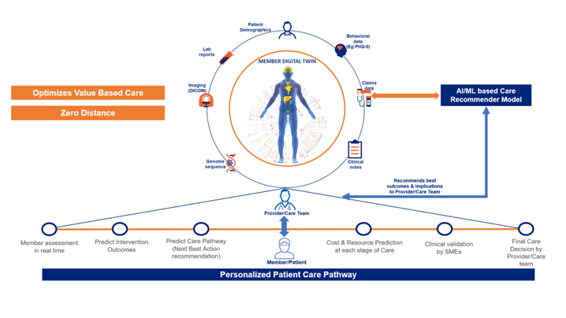

#Member Assessment with Digital Twin

Contact: Vaneshmanoj Murugan [email](mailto:vaneshmanoj.murugan@optum.com) / Sandeep Sharma [email](mailto:sandeep.sharma@optum.com)

##Overview
##What is a Digital Twin?
A digital twin is a virtual representation of a physical object, process, service or environment. It is a replica of the characteristics, behaviors, and functionalities of its counterpart in the real-world.

##Why Digital Twin for Healthcare?
In the context of healthcare, a digital twin can represent a patient, a medical device, a healthcare facility, or even an entire healthcare system. At a macro level, an estimated 30% of health care spending may be considered as waste. Some of the common reasons of this wastage are: care delivery and care co-ordination failure, over-treatment or low-value care, pricing failure, fraud & abuse, and administrative complexity.

An accurate member assessment can reduce this waste by directing members to high value care. Representation of a member’s current health status as a Digital Twin would be a game-changer that can help with insights to enable the reduction of above-mentioned wastes and lead to huge dollar savings.

##Stakeholders
Business Partners - UHG Chief Medical Officer, UHC Consumer Office.

##Whom we intend to help and how?
The key end-users of our proposed digital twin solution are:

##Providers

We intend to help them with better outcomes while optimizing site or care, level of care, hospital readmissions etc.
Equip with information from Digital Twin as decision support or recommendation.
Care Management Team

Care Management teams focus on delivery of defined care programs. The hypothesis is that same interventions will work for entire cohort. We move beyond risk stratified care programs to personalized interventions depending on patient condition, location, and host of clinical factors.

##Opportunity for OptumAI
Optum AI’s focus is to improve the member assessment using a Digital Twin that would impact the quality of care for the member with a personalized approach. The solution approach is to model and recommend an individualized personal medical care pathway by collecting data of medical activities carried over a period as part of an individual’s medical treatment plan by creating a Digital Twin. This will directly reflect on patient benefits like, the cost associated with a procedure or condition.

##Our Solution Approach
We have learnt from past experiences that care decisions are complex. Precision care requires a multi-layered assessment of the member, and it directly impacts the care pathway chosen for the member. Generally, physicians make complex assessment and intuitively make predictions of future state of patient to make decisions on care pathways. In this context, if we are able to compare similar care pathways with the best-in-class care pathways, it will help us in making better care decisions. We propose a digital-twin based AI/ML solution that can enable the physician to provide high quality and value-based care to the member. Below is a high-level representation of our solution approach

1. First, we create a patient digital twin (virtual member profiles) using observational data from various sources such as:

Data Sources | 
------------ | 
Claims data - Diagnosis codes, Procedure codes. | 
Member demographics & geographical information. | 
Patient charts (CCD-A) including Rx.|
Lab results and Radiology reports.|
Imaging (DICOM).|
Behavioral Assessments like PHQ-9.|
Genome sequence.|

2. Value-based care cannot be done without accurate member assessments and outcomes data. So, we identify ideal patients with similar features (patient similarity).

3. Assess patient condition and associated costs at each stage. Considering this member assessment as baseline, compare it with post-intervention assessment. This will help us to determine the quality and value of the intervention.
4. Analyze patterns of care pathways and feed them to an advanced deep graph neural network. Integrate the learned knowledge from the graph neural network (bottom-up approach) with existing data from healthcare knowledge graph (top-down approach) to generate care pathways.
5. Validate the correctness of the generated care path quantitatively and qualitatively (Compare the generated care pathways with the existing ruled based legacy care path generator like Rally).
6. Clinical SMEs will validate the results of Digital Twin with their current processes and preferred Care pathways.
7. Final care decision is taken by the Provider / Care Management team based on insights and validation done.

#Weekly Sprint Progress

#Reference

Github Repo - [click here](https://github.optum.com/pvenka53/India_Internships_2023_Sandeep/tree/main/Digital%20Twin/)

Aha Idea - [click here](https://chatgptllm.ideas.aha.io/ideas/CHATGPTLLM-I-260/)