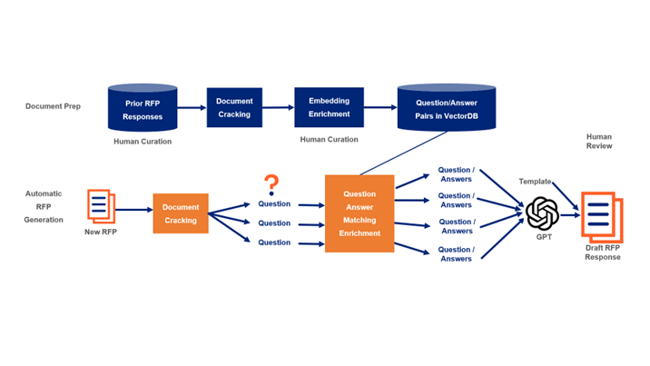
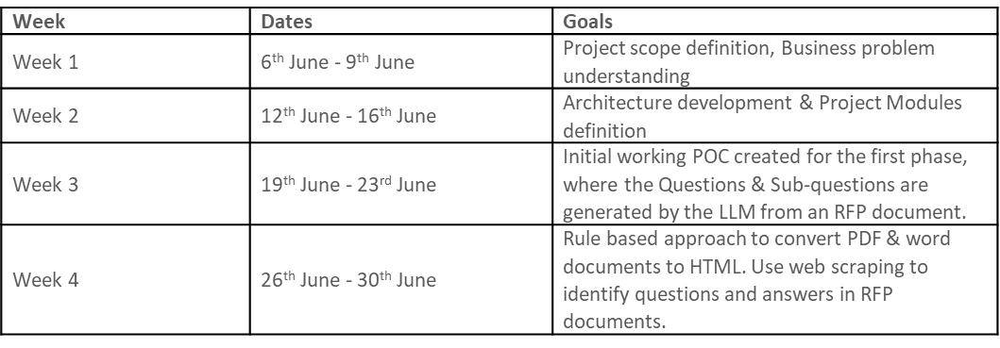

#RFP Response Generation Tool

##Overview

Request For Proposal (RFP) is a document that solicits a proposal by government or company or any organization, usually they ask for certain questions to understand the capability of the bidders and why they are best suited to win this proposal. Every year, UHG has been submitting and winning multiple RFPs. In some of the RFPs, questionnaire document runs into hundreds of pages easily with lot of questions. Currently, there are multiple teams in UHG who write responses to these questions manually. This requires huge amount of time and resources. We want to utilize the recent advancements in LLM models to benefit these teams by automating the response generation for such questions in the RFP documents.

##Stakeholders
Business Partners - Optum Growth Operations.

##Role of OptumAI
Develop an Intelligent agent using generative AI that can craft RFP responses in a detailed manner by referring to the prior RFP responses available in templates. We tend to use the RFP Question & Answer bank from the records of the Growth Office that can be used as reference templates.

##Solution Approach
Our proposed solution includes two phases. In first phase, we do the document preparation and in second phase, we do the RFP response generation.

##Phase I - Document Preparation:

For the document preparation pipeline, users upload an existing RFP response containing questions and answers. A sample question from the document is entered into the system, allowing the program to identify the format and style of questions and answers present within the document. Utilizing this style template, we extract all the relevant question and answer pairs and stores them in a vector database. This process is then repeated for all RFP responses, creating a comprehensive knowledge base.

##Phase II - Automatic RFP Generation:

When a new RFP is received, the generator extracts questions from the document in a similar manner. It then searches the database for similar questions and retrieves the corresponding answers. Using GPT, the system generates a tailored response for each question based on the available answers from the knowledge base created in Phase I. This results in a customized and comprehensive RFP response.

##Weekly Sprint Progress

#Reference

Github Repo - [Click Here](https://github.optum.com/apunetha/RFP-response-generation/)

Aha Idea - [Click Here](https://chatgptllm.ideas.aha.io/ideas/CHATGPTLLM-I-261/)